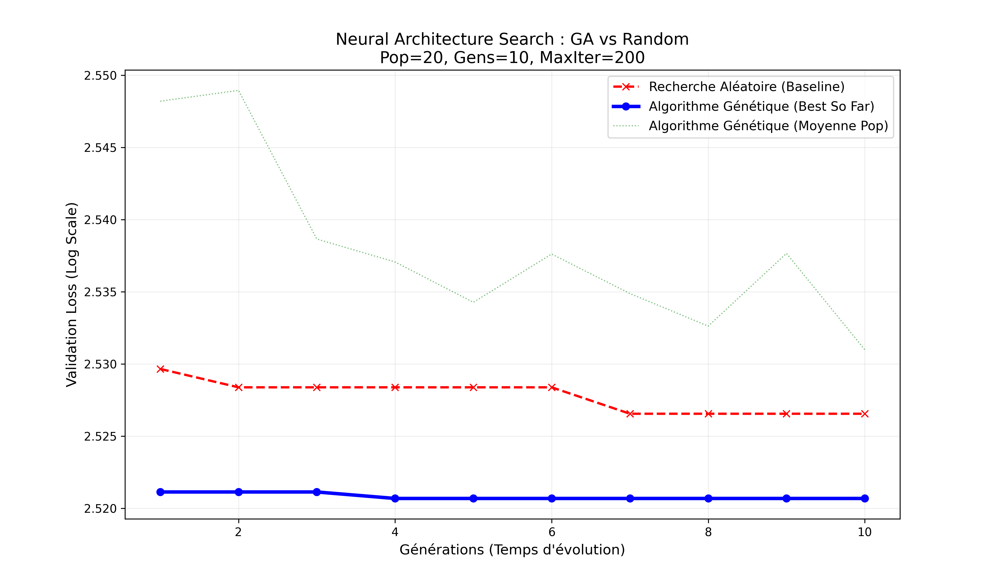

# 🧬 Evolutionary Optimization for Large Language Models


## 📖 Overview

This project explores the application of **Evolutionary Algorithms** to solve the **Neural Architecture Search (NAS)** and **Hyperparameter Optimization (HPO)** problems for Large Language Models (LLMs).

Using a **NanoGPT** architecture (Transformer Decoder-only) as a proxy model, I implemented a custom **Genetic Algorithm** from scratch to autonomously design the optimal network structure and training configuration. The approach is benchmarked against a strong **Random Search baseline** to demonstrate the efficiency of evolutionary search strategies in complex, non-convex landscapes.

## 🚀 Key Features

* **Custom Genetic Algorithm:** Implementation of Tournament Selection, Elitism, Gaussian Mutation, and Uniform Crossover.
* **Neural Architecture Search (NAS):** The algorithm dynamically evolves the model's depth (`n_layer`) and width (`n_embd`) along with training hyperparameters (`learning_rate`, `batch_size`).
* **Proxy Modeling:** Trained on the **TinyShakespeare** dataset to allow for rapid iterative evaluation (200+ full training runs). ( https://raw.githubusercontent.com/karpathy/char-rnn/master/data/tinyshakespeare/input.txt)
* **Advanced Analytics:** Visualization of **Search Landscape Exploration** and **Population Diversity** dynamics.
* **hyper parametres a modifier:**        
     on definie les valeurs que peuvent prendre les hyperparametres 
        
            'lr': (0.0001, 0.01), # learning rate aka la vitesse d'apprentissage
            'dropout': (0.0, 0.5) # taux de dropout aka pour eviter au modèle de tricher en apprenant par cœur
        
        
            'batch_size': [16, 32, 64, 128], #taille des lots de données traités simultanément.
            'n_embd': [32, 64, 128], # (Largeur) : La "capacité de mémorisation" du modèle.
            'n_layer': [2, 4, 6],   # profondeur du modeleLa "capacité de raisonnement" (abstraction).
            

## 📊 Results & Analysis

The Genetic Algorithm successfully outperformed the Random Search baseline, achieving a lower final validation loss.

* **Convergence:** The GA showed a monotonic improvement in the "Best-So-Far" loss, validating the effectiveness of the selection pressure.
* **Diversity:** Analysis of population variance confirms that the algorithm maintained sufficient genetic diversity to escape local minima (exploration) before converging (exploitation).


*(Evolution of Validation Loss: Genetic Algorithm vs Random Search)*

## 🛠️ Tech Stack

* **Core:** Python 3.x
* **Deep Learning:** PyTorch (CUDA supported)
* **Data Processing:** NumPy
* **Visualization:** Matplotlib

## 💻 Usage

1.  **Clone the repository:**
    ```bash
    git clone [https://github.com/ton-username/LLM-Genetic-Optimization.git](https://github.com/ton-username/LLM-Genetic-Optimization.git)
    cd LLM-Genetic-Optimization
    ```

2.  **Install dependencies:**
    ```bash
    pip install -r requirements.txt
    ```

3.  **Run the optimization:**
    ```bash
    python main.py
    ```

## 👨‍💻 Author

**[Ton Prénom Nom]**
*Master's Student in Data Science & AI at ESILV*